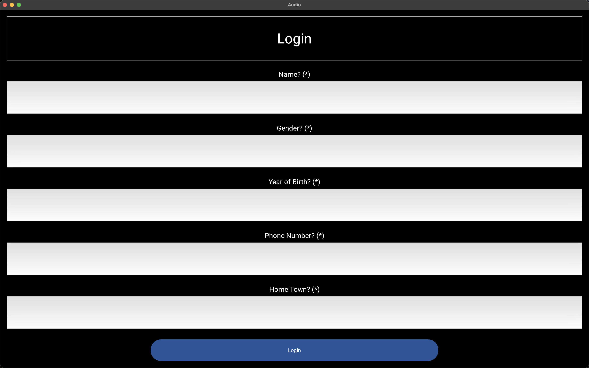
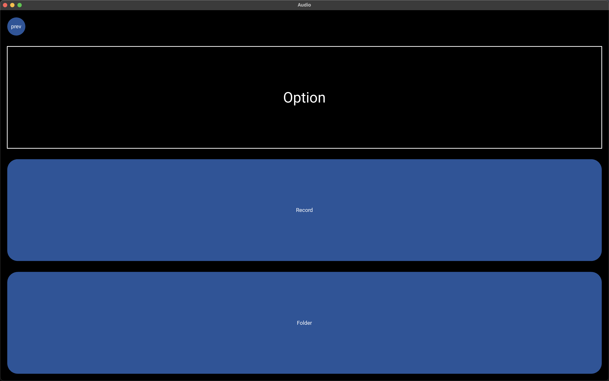
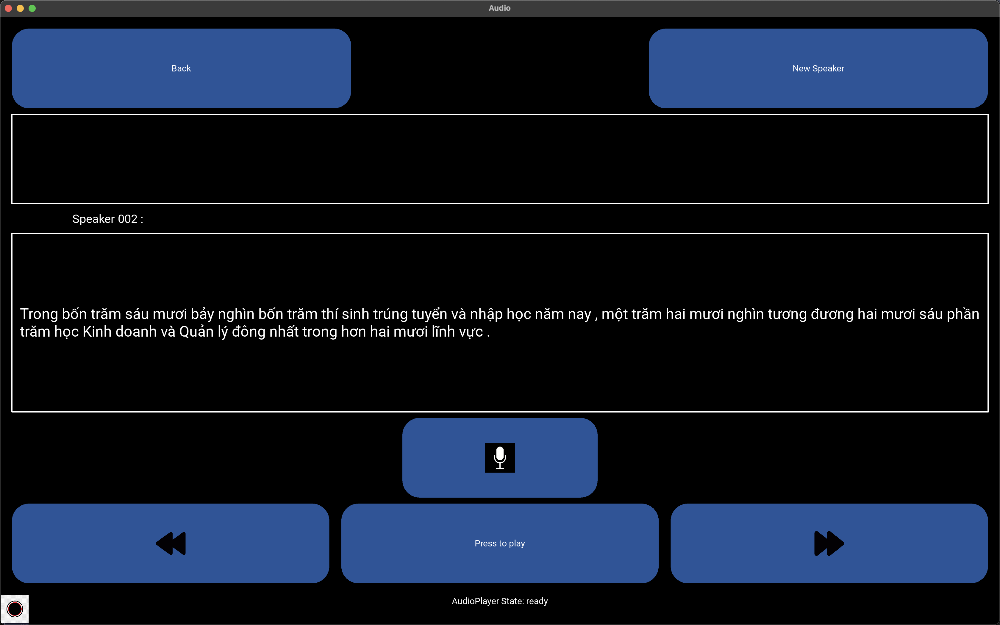
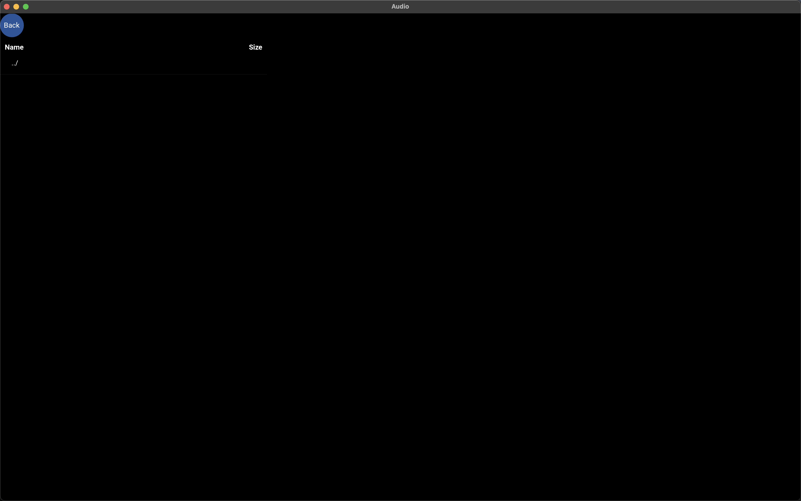
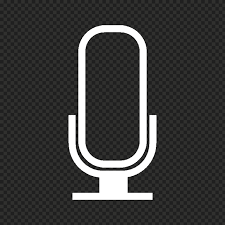

# Recording App

## Introduction

- App ghi âm phục vụ thu dữ liệu cho bài toán xử lí âm thanh : phục hồi giọng nói theo tiếng Việt.

## Features

- Chức năng ghi âm thông thường của một app recorder. 
- Hiển thị dữ liệu từng câu cho người đọc dễ hình dung và đọc theo.
- Chức năng xem file giúp phát hiện và kiểm tra, chỉnh sửa đoạn ghi âm

## Screenshot









## Installation

### Create Virtual Environment
- Truy cập [miniforge](https://github.com/conda-forge/miniforge) cài phiên bản phù hợp với hệ thống.
- Tạo môi trường ảo cho python :

``` 
    $ conda create -n env_app python=3.9
```

### Install Kivy
```
    $ conda install kivy -c conda-forge
```


### Install requirement
```
    $ git clone git@github.com:natalieconan/Recorder.git
    $ pip3 install -r ./Info/Requirements.txt
```
> **Warning**: Đôi khi một số bạn bị lỗi khi cài pyaudio. Khi đó bạn cần chạy thêm một số lệnh: 
>- mac: ``` $ brew install portaudio```
>- linux: ``` $ sudo install portaudio ```
>- window: ``` $ pip3 install pipwin &  pipwin install pyaudio ```

## Compile

``` 
    $ conda activate env_app
    $ python3 Audio.py
```

## Usage

### Giao diện đăng nhập 
- Bạn sẽ phải nhập đầy đủ các thông tin cần thiết và sử dụng hoàn toàn tiếng anh.
> **Note**: Năm sinh - ```Year of Birth``` và số điện thoại - ```Phone Number``` bắt buộc sử dụng chữ số 

- Sau đó bấm ``` login ``` để đăng nhập, hệ thống sẽ tự động lưu trữ giữ liệu của bạn vào file ```speaker.csv``` và tăng `id_speaker` và lưu trữ số lượng người đã tham gia ở trong file `speakerId.txt`.

### Giao diện lựa chọn
- Bạn sẽ có 2 lựa chọn: 
    - Chọn `Record` để sử dụng chế độ ghi âm.
    - Chọn `Folder` để sử dụng chế độ xem lại file.

### Giao diện ghi âm
- Chọn icon   để bắt đầu ghi âm. Trong trường hợp đã ghi âm câu thoại này thì icon sẽ đổi thành , bấm lần 2 có thể lựa chọn ghi âm lại hoặc không.
- Biểu tượng  để chuyển sang câu thoại kế tiếp, bạn có thể lựa chọn bỏ câu này nếu quá khó.
- Biểu tượng  dùng để chuyển về câu thoại trước đó trong trường hợp kiểm tra và ghi âm lại câu thoại
- Button `Add Speaker` sẽ hoạt động khi bạn đã hoàn thành xong cuộc ghi âm và chuyển sang Login Screen để đăng nhập nguời mới.

### Giao diện folder
- Hiển thị các thư mục gồm file ghi âm của speaker. bạn có thể nghe lại bài ghi âm của mình và đọc text ở bên cạnh để kiểm tra.
